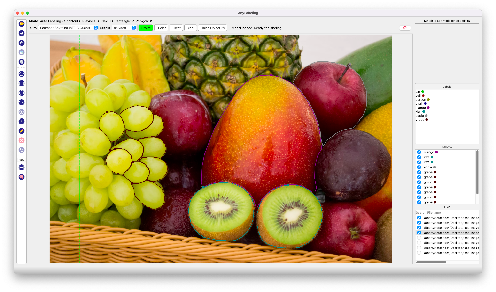

<p align="center">
  
  <h1 align="center">🌟 AnyLabeling 🌟</h1>
  <p align="center">Effortless data labeling with AI support from <b>YOLO</b> and <b>Segment Anything</b>!<p>
  <p align="center"><b>AnyLabeling = LabelImg + Labelme + Improved UI + Auto-labeling</b><p>
</p>


[](https://pypi.org/project/anylabeling)
[](https://github.com/vietanhdev/anylabeling/blob/master/LICENSE)
[](https://github.com/vietanhdev/anylabeling/issues)
[](https://pypi.org/project/anylabeling/)
[](https://anylabeling.com/)

<a href="https://www.youtube.com/watch?v=xLVz-f6OeUY">
  
</a>

- **Youtube Demo:** [https://www.youtube.com/watch?v=xLVz-f6OeUY](https://www.youtube.com/watch?v=xLVz-f6OeUY)
- **Documentation:** [https://anylabeling.com](https://anylabeling.com)

## I. Install and run

### 1. Download and run executable

- Download and run newest version from [Releases](https://github.com/vietanhdev/anylabeling/releases).
- For MacOS:
  - After installing, go to Applications folder
  - Right click on the app and select Open
  - From the second time, you can open the app normally using Launchpad

### 2. Install from Pypi

- Requirements: Python >= 3.8
- Recommended: Miniconda/Anaconda <https://docs.conda.io/en/latest/miniconda.html>

- Create environment:

```bash
conda create -n anylabeling python=3.8
conda activate anylabeling
```

- **(For macOS only)** Install PyQt5 using Conda:

```bash
conda install -c conda-forge pyqt==5.15.7
```

- Install anylabeling:

```bash
pip install anylabeling
```

- Run app:

```bash
anylabeling
```

Or

```bash
python -m anylabeling.app
```

## II. Development

- Generate resources:

```bash
pyrcc5 -o anylabeling/resources/resources.py anylabeling/resources/resources.qrc
```

- Run app:

```bash
python anylabeling/app.py
```

## III. Build executable

- Install PyInstaller:

```bash
pip install -r requirements-dev.txt
```

- Build:

```bash
bash build_executable.sh
```

- Check the outputs in: `dist/`.

## IV. Contribution

If you want to contribute to **AnyLabeling**, please read [Contribution Guidelines](https://anylabeling.com/docs/contribution).

## V. References

- Labeling UI built with ideas and components from [LabelImg](https://github.com/heartexlabs/labelImg), [labelme](https://github.com/wkentaro/labelme).
